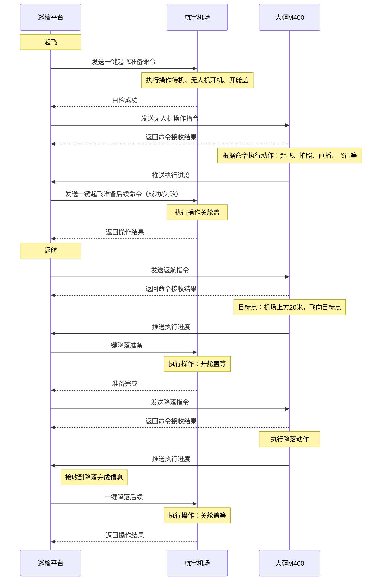

# 航宇机场与大疆无人机通讯方案

## 一、概述

### 1.1 项目背景

    本次项目核心设备为大疆M400行业无人机，该机型暂无大疆官方配套全自动机场设备，无法适配大疆官方机场管控体系，也不支持大疆云端上云API对接能力，无法依托大疆原生云端平台实现无人机全自动值守、远程调度、设备状态管控等一体化作业功能。

    为满足M400无人机全自动起降、自主充电、无人值守作业的业务需求，项目采购了适配该机型的第三方定制全自动机场设备，以此实现无人机的停放、防护、自动充断电、舱门联动等基础场站功能。但第三方机场与大疆原生管控体系相互独立，无官方通用对接协议，无法直接复用大疆官方飞控及云端管理能力。

    受硬件适配及官方接口限制，本项目无法依托大疆原有飞控系统完成整机作业管控，需单独采购配套第三方管控平台，并自主研发适配M400无人机+第三方机场的专属飞控系统。通过自研飞控打通无人机飞行控制、航线规划、姿态调控与第三方机场设备的联动通信壁垒，实现无人机飞行作业、机场设备启停、状态数据交互的协同联动，最终搭建一套完全自主可控、适配本项目硬件设备的全自动无人机作业管控体系，满足常态化无人值守巡检、自主作业、远程运维的核心业务需求。

### 1.2 整体架构

### 1.3 方案目标

1. 打通航宇第三方机场与M400无人机的跨设备联动逻辑，由巡检平台统一调度：实现机场舱门自动开关、自主充断电与无人机起飞、返航回仓、充电待命流程自动联动，达成全流程无人值守。

2. 解决M400无官方配套机场、无法接入大疆上云API的痛点，依托遥控器MSDK对接无人机、WebSocket对接第三方机场的双链路架构，脱离大疆官方云端体系，构建完全自主可控的设备管控链路。

3. 搭建统一前端功能展示层，完整覆盖场站与机载全量业务操作，实现机场控制、飞行控制、航线任务下发、视频直播、探照灯调控、喊话、拍照、录像一体化可视化操作，支持操作人员远程完成全流程无人值守巡检作业。

4. 实现全业务指令统一收口，前端通过HTTP接口与后台巡检平台交互，完成任务创建、设备控制、媒体文件调取、实时画面预览等全场景业务操作，操作指令与设备状态反馈实时同步。

## 二、通讯协议

### 2.1 机场通讯

- 传输协议：标准 WebSocket（ws/wss 加密），全双工长连接
- 数据格式：一般默认为一个单纯字符串，个别字符串是JSON格式
- 数据编码：字符集统一使用ascii

### 2.2 无人机通讯

- 传输协议：MQTT 3.1.1/5.0，支持 TLS 加密传输

- QoS 分级策略：
  
  - 飞行控制指令、急停指令：QoS 1（至少送达一次）
  - 无人机实时位置、姿态：QoS 0（高频实时上报，允许少量丢包）
  - 告警、拍照录像结果、媒体回调：QoS 2（仅送达一次，确保可靠）

- Topic 分层命名规范，区分上行、下行、事件、心跳四类主题

## 三、业务交互流程

## 四、附录

### 4.1 参考资料

[MSDK介绍](https://developer.dji.com/cn/mobile-sdk/)

[MSDK文档](https://developer.dji.com/doc/mobile-sdk-tutorial/cn/overview.html)

[MSDK API](https://developer.dji.com/cn/api-reference-v5/android-api/Components/SDKManager/DJISDKManager.html)

### 4.2 遥控器上安卓软件要实现的功能

#### 4.2.2 属性信息

- 属性上报

- 属性设置

#### 4.2.3 航线任务

- 航线下发

- 取消航线任务

- 开始航线任务

- 航线暂停

- 航线恢复

- 一键返航

- 航线任务就绪通知

- 航线进度上报

#### 4.2.4 飞行控制

- 获取控制权

- 释放控制权

- 杆量控制

- 急停

- 降落

- 飞向目标点

#### 4.2.5 相机控制

- 获取控制权

- 切换相机模式-拍照、录像、全景拍照

- 开始拍照

- 结束拍照

- 开始录像

- 结束录像

- 云台重置

- 变焦

- 双击成为中心点（双击屏幕，该点成为页面中心点）

#### 4.2.6 直播

- 开启直播

- 关闭直播

- 直播相机切换

- 清晰度设置

- 直播镜头切换

#### 4.2.7 负载控制

- 喊话器
  
  - 开始
  
  - 停止
  
  - 重新播放
  
  - 音量设置
  
  - 播放模式设置

- 探照灯
  
  - 模式设置-开、关、闪烁
  
  - 亮度设置
  
  - 左右角度微调
  
  - 云台校准

#### 4.2.8 媒体文件

- 获取oss配置

- 文件上传

- 上报文件上传进度

#### 4.2.9 健康信息上报

